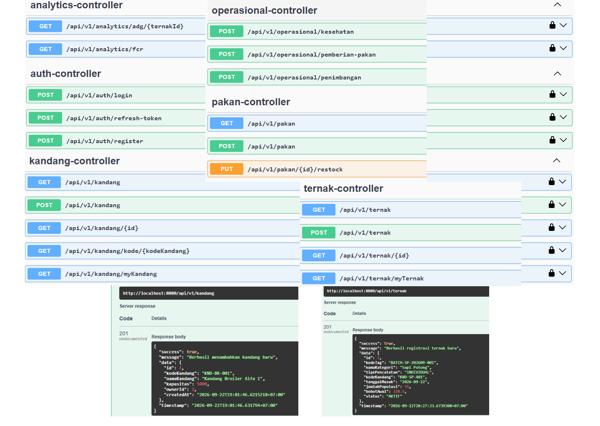
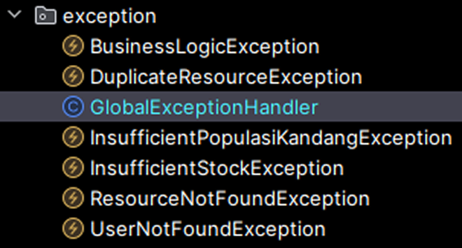
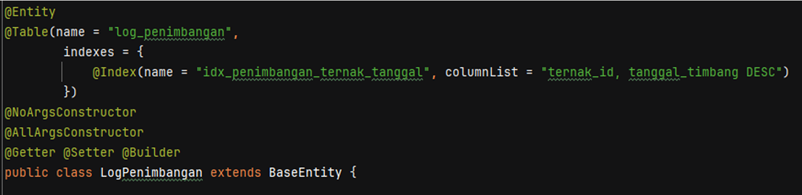
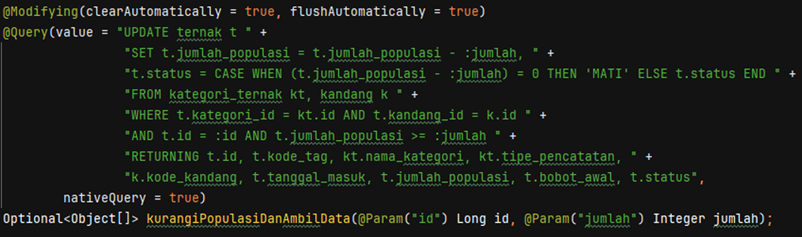
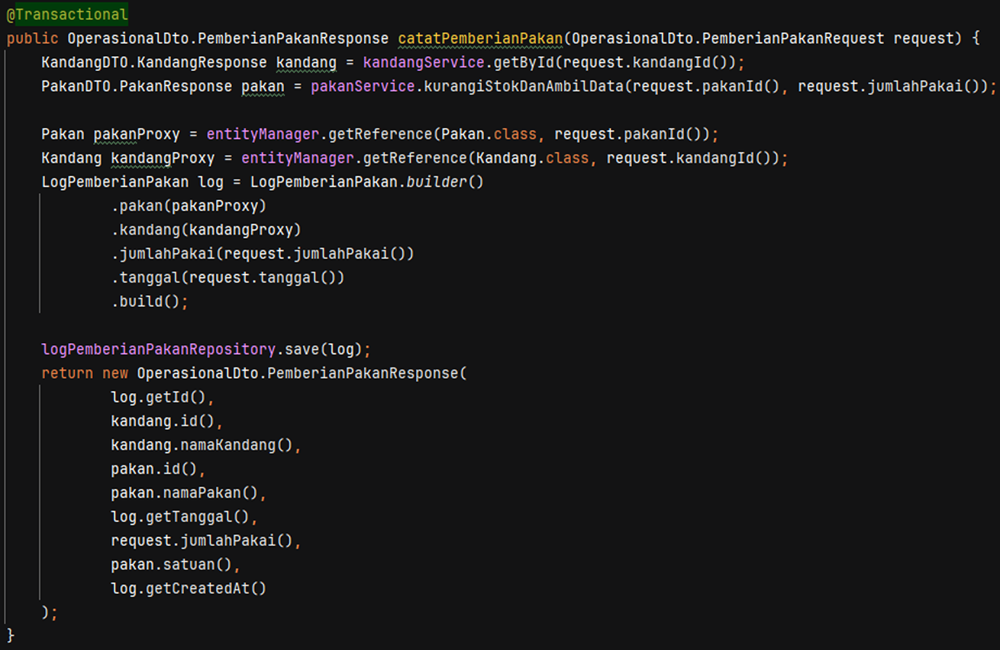
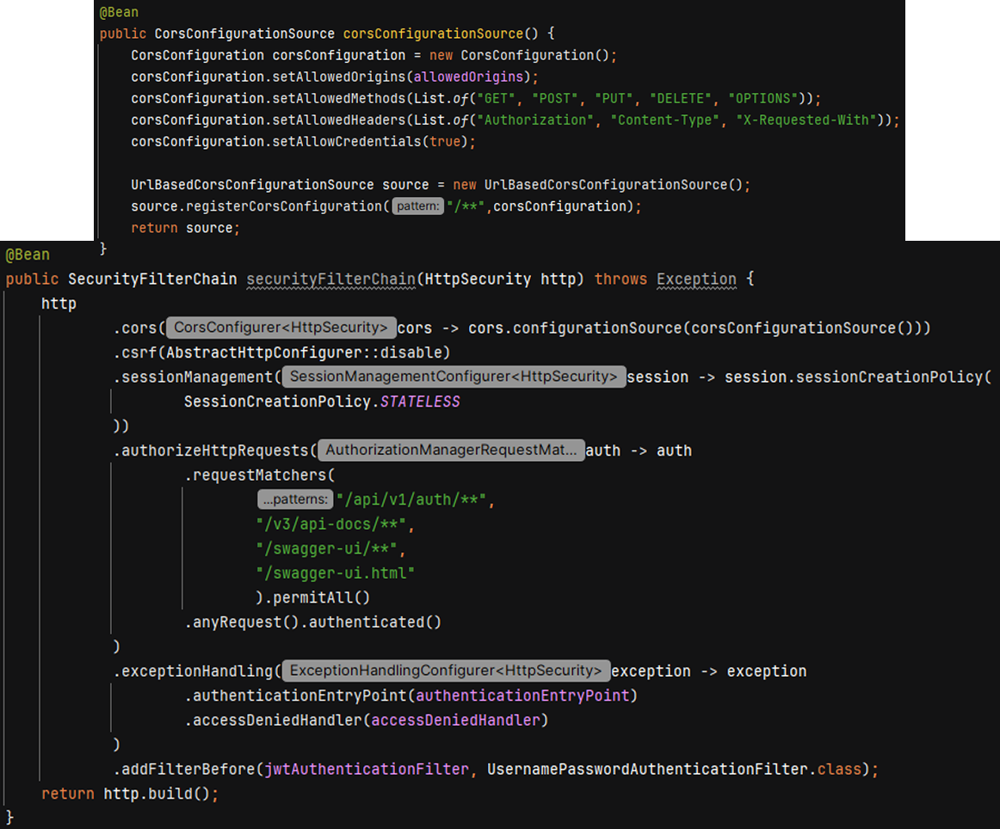
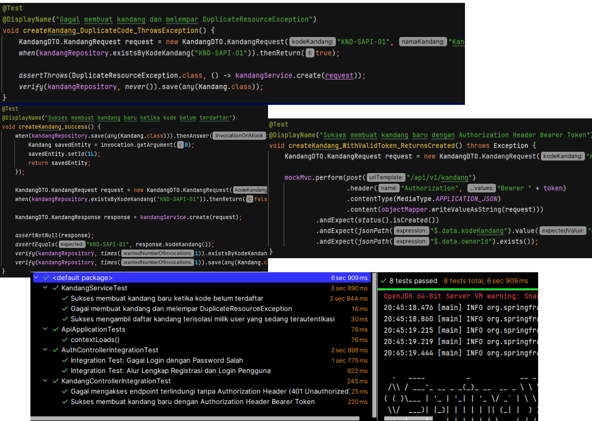

# manajemen-kandang-api

Backend RESTful API berbasis Java & Spring Boot untuk sistem manajemen inventaris peternakan, operasional harian, dan pencatatan kesehatan/pakan dengan dukungan arsitektur multi-tenant (data isolation) dan autentikasi JWT.

---

## Teknologi

* **Language**: Java 17
* **Framework**: Spring Boot 4.1.1 (WebMVC, Data JPA, Security, Validation)
* **Database**: PostgreSQL
* **Database Migration**: Flyway
* **Security**: Spring Security, JJWT (io.jsonwebtoken 0.12.5)
* **Documentation**: Springdoc OpenAPI / Swagger UI 3.1.0
* **Testing**: JUnit 5, Mockito, MockMvc, H2 Database

---

## Fitur Utama

1. **Authentication & Authorization**: Stateless JWT (Access Token 15 menit & Refresh Token Rotation 7 hari).
2. **Data Isolation (Tenant Isolation)**: Pemfilteran data otomatis berbasis `owner_id` untuk mencegah pengaksesan lintas user.
3. **Master Data Management**: Pengelolaan data kandang, kategori ternak, dan pakan.
4. **Operasional & Inventaris**: Pencatatan populasi ternak, pengurangan populasi, riwayat penimbangan (ADG), log kesehatan, dan penggunaan pakan.
5. **Database Migration**: Skema versi otomatis menggunakan Flyway.
6. **API Documentation**: Integrasi Swagger UI interaktif dengan dukungan *Bearer Auth*.

---

## Cara Instalasi & Menjalankan
Prasyarat
* Java 17 atau lebih baru
* Maven 3.8+
* PostgreSQL 14+

1. git clone [https://github.com/username/manajemen-kandang-api.git](https://github.com/username/manajemen-kandang-api.git)  
   cd manajemen-kandang-api
2. Buat database PostgreSQL sesuai pada konfigurasi application.properties
3. Sesuaikan src/main/resources/application.properties  
   spring.datasource.url=jdbc:postgresql://localhost:5432/`db_name`  
   spring.datasource.username=`postgres`  
   spring.datasource.password=`postgres`  
   app.jwt.secret=`change_32_random_chars`  
   app.jwt.expiration-ms=`900000`  
   app.jwt.refresh-expiration-ms=`604800000`
4. Jalankan Aplikasi
   `mvn spring-boot:run`
5. Akses swagger UI `http://localhost:8080/swagger-ui.html`

---

## Testing
Proyek ini dilengkapi dengan Unit Test (Mockito) dan Integration Test (MockMvc & H2 In-Memory Database).  
Jalankan seluruh test suite dengan perintah:  
`mvn test`

## Skema Database (ERD)


## Dokumentasi API (Endpoints)

Seluruh endpoint (kecuali `auth` dan dokumentasi Swagger) bersifat **protected** dan wajib menyertakan header `Authorization: Bearer <access_token>`. Response mengikuti format standar:

```json
{
  "success": true,
  "message": "...",
  "data": { },
  "timestamp": "2026-09-22T19:01:46.631794+07:00"
}
```



### Auth Controller
| Method | Endpoint                     | Deskripsi                              | Akses  |
|--------|-------------------------------|-----------------------------------------|--------|
| POST   | `/api/v1/auth/register`       | Registrasi user baru                    | Public |
| POST   | `/api/v1/auth/login`          | Login, menerbitkan access & refresh token | Public |
| POST   | `/api/v1/auth/refresh-token`  | Rotasi refresh token & terbitkan access token baru | Public |

### Kandang Controller
| Method | Endpoint                              | Deskripsi                                  |
|--------|-----------------------------------------|---------------------------------------------|
| GET    | `/api/v1/kandang`                      | Daftar seluruh kandang milik user           |
| POST   | `/api/v1/kandang`                      | Tambah kandang baru                         |
| GET    | `/api/v1/kandang/{id}`                 | Detail kandang berdasarkan ID               |
| GET    | `/api/v1/kandang/kode/{kodeKandang}`   | Detail kandang berdasarkan kode unik        |
| GET    | `/api/v1/kandang/myKandang`            | Daftar kandang milik user terautentikasi    |

Contoh response `POST /api/v1/kandang`:
```json
{
  "success": true,
  "message": "Berhasil menambahkan kandang baru",
  "data": {
    "id": 3,
    "kodeKandang": "KND-BR-001",
    "namaKandang": "Kandang Broiler Alfa 1",
    "kapasitas": 5000,
    "ownerId": 2,
    "createdAt": "2026-09-22T19:01:46.6215218+07:00"
  },
  "timestamp": "2026-09-22T19:01:46.631794+07:00"
}
```

### Ternak Controller
| Method | Endpoint                     | Deskripsi                                   |
|--------|--------------------------------|-----------------------------------------------|
| GET    | `/api/v1/ternak`               | Daftar seluruh ternak milik user              |
| POST   | `/api/v1/ternak`               | Registrasi batch/individu ternak baru         |
| GET    | `/api/v1/ternak/{id}`          | Detail ternak berdasarkan ID                  |
| GET    | `/api/v1/ternak/myTernak`      | Daftar ternak milik user terautentikasi       |

### Pakan Controller
| Method | Endpoint                          | Deskripsi                          |
|--------|-------------------------------------|--------------------------------------|
| GET    | `/api/v1/pakan`                    | Daftar seluruh stok pakan            |
| POST   | `/api/v1/pakan`                    | Tambah jenis pakan baru              |
| PUT    | `/api/v1/pakan/{id}/restock`       | Menambah stok pakan (restock)        |

### Operasional Controller
| Method | Endpoint                                  | Deskripsi                                 |
|--------|----------------------------------------------|----------------------------------------------|
| POST   | `/api/v1/operasional/kesehatan`             | Catat log kesehatan/kejadian pada ternak      |
| POST   | `/api/v1/operasional/pemberian-pakan`       | Catat pemberian pakan ke kandang & kurangi stok |
| POST   | `/api/v1/operasional/penimbangan`           | Catat hasil penimbangan bobot ternak          |

### Analytics Controller
| Method | Endpoint                              | Deskripsi                                            |
|--------|------------------------------------------|---------------------------------------------------------|
| GET    | `/api/v1/analytics/adg/{ternakId}`      | Hitung Average Daily Gain (ADG) dari riwayat penimbangan |
| GET    | `/api/v1/analytics/fcr`                 | Hitung Feed Conversion Ratio (FCR)                       |

---

## Arsitektur & Keputusan Teknis

Bagian ini menjelaskan beberapa keputusan desain teknis yang diterapkan untuk menjaga performa dan konsistensi data pada aplikasi.

### 1. Global Exception Handling

Penanganan error dipusatkan pada satu `@ControllerAdvice` agar seluruh response error memiliki format yang konsisten di semua endpoint. Setiap kasus bisnis dipetakan ke exception custom-nya masing-masing:



```
exception/
├── BusinessLogicException.java
├── DuplicateResourceException.java
├── GlobalExceptionHandler.java
├── InsufficientPopulasiKandangException.java
├── InsufficientStockException.java
├── ResourceNotFoundException.java
└── UserNotFoundException.java
```

* `DuplicateResourceException` → HTTP 409 (mis. kode kandang sudah terdaftar)
* `ResourceNotFoundException` / `UserNotFoundException` → HTTP 404
* `InsufficientStockException` / `InsufficientPopulasiKandangException` → HTTP 400 (validasi bisnis, mis. stok pakan/populasi ternak tidak mencukupi)
* `BusinessLogicException` → HTTP 422 untuk pelanggaran aturan bisnis umum
* `MethodArgumentNotValidException` (Bean Validation) & exception tak terduga lainnya juga ditangani agar tidak ada stack trace yang bocor ke client

Semua exception dikembalikan dalam bentuk response terstruktur yang sama seperti response sukses (`success: false`, `message`, `timestamp`), sehingga konsumen API tidak perlu menangani banyak format error berbeda.

### 2. Database Indexing

Query yang sering dijalankan (mis. mengambil riwayat penimbangan terbaru seekor ternak untuk kalkulasi ADG) diberi index komposit agar tidak melakukan *full table scan*:



```java
@Entity
@Table(name = "log_penimbangan",
        indexes = {
            @Index(name = "idx_penimbangan_ternak_tanggal", columnList = "ternak_id, tanggal_timbang DESC")
        })
@NoArgsConstructor
@AllArgsConstructor
@Getter @Setter @Builder
public class LogPenimbangan extends BaseEntity {
    // ...
}
```

Index `(ternak_id, tanggal_timbang DESC)` mempercepat query `WHERE ternak_id = ? ORDER BY tanggal_timbang DESC` yang menjadi dasar perhitungan **Average Daily Gain (ADG)** pada modul analytics, karena database cukup melakukan *index scan* alih-alih memindai seluruh baris tabel.

### 3. Mengatasi N+1 Problem pada Operasi Update Relasional

Operasi pengurangan populasi ternak awalnya berisiko menimbulkan N+1 query: satu query untuk update, lalu query tambahan untuk mengambil ulang data ternak beserta relasinya (`kategori_ternak`, `kandang`) untuk disusun ke response. Solusinya adalah menyatukan operasi *update* dan *fetch* data hasil join ke dalam **satu native query** menggunakan klausa `RETURNING`:



```java
@Modifying(clearAutomatically = true, flushAutomatically = true)
@Query(value = "UPDATE ternak t " +
        "SET t.jumlah_populasi = t.jumlah_populasi - :jumlah, " +
        "t.status = CASE WHEN (t.jumlah_populasi - :jumlah) = 0 THEN 'MATI' ELSE t.status END " +
        "FROM kategori_ternak kt, kandang k " +
        "WHERE t.kategori_id = kt.id AND t.kandang_id = k.id " +
        "AND t.id = :id AND t.jumlah_populasi >= :jumlah " +
        "RETURNING t.id, t.kode_tag, kt.nama_kategori, kt.tipe_pencatatan, " +
        "k.kode_kandang, t.tanggal_masuk, t.jumlah_populasi, t.bobot_awal, t.status",
        nativeQuery = true)
Optional<Object[]> kurangiPopulasiDanAmbilData(@Param("id") Long id, @Param("jumlah") Integer jumlah);
```

Dengan pendekatan ini:
* Validasi stok populasi (`jumlah_populasi >= :jumlah`) dilakukan langsung di level `WHERE` klausa, sehingga race condition antar-request dapat dihindari secara atomik.
* Data hasil join (`kategori_ternak`, `kandang`) langsung dikembalikan lewat `RETURNING`, sehingga tidak perlu query `SELECT` tambahan (N+1) untuk menyusun response DTO.
* `clearAutomatically` & `flushAutomatically` memastikan Persistence Context tetap konsisten dengan perubahan yang dilakukan lewat native query.

### 4. Optimasi Insert Data Relasional dengan JPA Proxy Reference

Saat menyimpan entitas yang hanya membutuhkan referensi *foreign key* ke entitas lain (tanpa perlu memuat seluruh datanya), digunakan `entityManager.getReference()` untuk mendapatkan **proxy reference**, bukan `findById()` yang akan memicu query `SELECT` penuh:



```java
@Transactional
public OperasionalDto.PemberianPakanResponse catatPemberianPakan(OperasionalDto.PemberianPakanRequest request) {

    KandangDTO.KandangResponse kandang = kandangService.getById(request.kandangId());
    PakanDTO.PakanResponse pakan = pakanService.kurangiStokDanAmbilData(request.pakanId(), request.jumlahPakai());

    Pakan pakanProxy = entityManager.getReference(Pakan.class, request.pakanId());
    Kandang kandangProxy = entityManager.getReference(Kandang.class, request.kandangId());

    LogPemberianPakan log = LogPemberianPakan.builder()
            .pakan(pakanProxy)
            .kandang(kandangProxy)
            .jumlahPakai(request.jumlahPakai())
            .tanggal(request.tanggal())
            .build();

    logPemberianPakanRepository.save(log);

    return new OperasionalDto.PemberianPakanResponse(
            log.getId(), kandang.id(), kandang.namaKandang(),
            pakan.id(), pakan.namaPakan(), log.getTanggal(),
            request.jumlahPakai(), pakan.satuan(), log.getCreatedAt()
    );
}
```

Karena validasi & data yang ditampilkan ke response (nama kandang, nama pakan, stok terbaru) sudah didapat lebih awal dari service masing-masing (`kandangService.getById`, `pakanService.kurangiStokDanAmbilData`), entitas `Pakan` dan `Kandang` tidak perlu dimuat ulang secara penuh hanya untuk keperluan *set relasi* saat insert `LogPemberianPakan`. `getReference()` hanya membuat proxy Hibernate berisi ID tanpa menyentuh database sampai field lain proxy tersebut benar-benar diakses (lazy), sehingga jumlah round-trip ke database berkurang signifikan.

### 5. Keamanan: Stateless JWT & CORS Terpusat

Konfigurasi keamanan menerapkan sesi *stateless* penuh (tanpa `HttpSession`) dengan autentikasi berbasis JWT filter, serta CORS yang didefinisikan terpusat dalam satu `CorsConfigurationSource`:



```java
@Bean
public CorsConfigurationSource corsConfigurationSource() {
    CorsConfiguration corsConfiguration = new CorsConfiguration();
    corsConfiguration.setAllowedOrigins(allowedOrigins);
    corsConfiguration.setAllowedMethods(List.of("GET", "POST", "PUT", "DELETE", "OPTIONS"));
    corsConfiguration.setAllowedHeaders(List.of("Authorization", "Content-Type", "X-Requested-With"));
    corsConfiguration.setAllowCredentials(true);

    UrlBasedCorsConfigurationSource source = new UrlBasedCorsConfigurationSource();
    source.registerCorsConfiguration("/**", corsConfiguration);
    return source;
}

@Bean
public SecurityFilterChain securityFilterChain(HttpSecurity http) throws Exception {
    http
        .cors(cors -> cors.configurationSource(corsConfigurationSource()))
        .csrf(AbstractHttpConfigurer::disable)
        .sessionManagement(session -> session.sessionCreationPolicy(
                SessionCreationPolicy.STATELESS
        ))
        .authorizeHttpRequests(auth -> auth
                .requestMatchers(
                        "/api/v1/auth/**",
                        "/v3/api-docs/**",
                        "/swagger-ui/**",
                        "/swagger-ui.html"
                ).permitAll()
                .anyRequest().authenticated()
        )
        .exceptionHandling(exception -> exception
                .authenticationEntryPoint(authenticationEntryPoint)
                .accessDeniedHandler(accessDeniedHandler)
        )
        .addFilterBefore(jwtAuthenticationFilter, UsernamePasswordAuthenticationFilter.class);
    return http.build();
}
```

Poin penting dari konfigurasi ini:
* **Stateless**: `SessionCreationPolicy.STATELESS` memastikan server tidak menyimpan session apa pun; identitas user sepenuhnya berasal dari klaim di dalam JWT pada setiap request.
* **CORS terpusat**: satu `CorsConfigurationSource` yang didaftarkan lewat `UrlBasedCorsConfigurationSource` untuk pattern `/**`, sehingga aturan origin/method/header yang diizinkan konsisten di seluruh endpoint dan mudah diubah dari satu tempat (`allowedOrigins` dikonfigurasi lewat properties).
* **Filter chain**: `JwtAuthenticationFilter` disisipkan sebelum `UsernamePasswordAuthenticationFilter` bawaan Spring Security untuk memvalidasi Access Token dan membangun `SecurityContext` sebelum request diteruskan ke controller.
* **Endpoint publik terbatas**: hanya jalur `auth`, dokumentasi OpenAPI, dan Swagger UI yang `permitAll()`; seluruh endpoint lain wajib terautentikasi.
* **Exception handling khusus**: `authenticationEntryPoint` dan `accessDeniedHandler` custom digunakan agar response 401/403 tetap mengikuti format JSON standar aplikasi, bukan halaman error default Spring.

---

## Contoh Unit & Integration Test

Berikut contoh test pada `KandangServiceTest` (unit test dengan Mockito) dan `KandangControllerIntegrationTest` (integration test dengan MockMvc):



```java
@Test
@DisplayName("Gagal membuat kandang dan melempar DuplicateResourceException")
void createKandang_DuplicateCode_ThrowsException() {
    KandangDTO.KandangRequest request = new KandangDTO.KandangRequest(
            /* kodeKandang: */ "KND-SAPI-01", /* namaKandang: */ "Kandang Sapi 1");

    when(kandangRepository.existsByKodeKandang("KND-SAPI-01")).thenReturn(true);

    assertThrows(DuplicateResourceException.class, () -> kandangService.create(request));
    verify(kandangRepository, never()).save(any(Kandang.class));
}

@Test
@DisplayName("Sukses membuat kandang baru dengan Authorization Header Bearer Token")
void createKandang_WithValidToken_ReturnsCreated() throws Exception {
    KandangDTO.KandangRequest request = new KandangDTO.KandangRequest(/* kodeKandang: */ "KND-...");

    mockMvc.perform(post("/api/v1/kandang")
                    .header("Authorization", "Bearer " + token)
                    .contentType(MediaType.APPLICATION_JSON)
                    .content(objectMapper.writeValueAsString(request)))
            .andExpect(status().isCreated())
            .andExpect(jsonPath("$.data.kodeKandang").value("KND-..."))
            .andExpect(jsonPath("$.data.ownerId").exists());
}
```

Skenario test yang dicakup meliputi: validasi bisnis (kode kandang duplikat), isolasi data antar-tenant (`myKandang` hanya mengembalikan data milik user yang login), autentikasi (401 tanpa header `Authorization`), serta alur registrasi & login end-to-end.

Ringkasan hasil eksekusi:

```
✓ 8 tests passed, 8 tests total, 6 sec 909 ms

KandangServiceTest
  ✓ Sukses membuat kandang baru ketika kode belum terdaftar
  ✓ Gagal membuat kandang dan melempar DuplicateResourceException
  ✓ Sukses mengambil daftar kandang terisolasi milik user yang sedang terautentikasi
ApiApplicationTests
  ✓ contextLoads()
AuthControllerIntegrationTest
  ✓ Integration Test: Gagal Login dengan Password Salah
  ✓ Integration Test: Alur Lengkap Registrasi dan Login Pengguna
KandangControllerIntegrationTest
  ✓ Gagal mengakses endpoint terlindungi tanpa Authorization Header (401 Unauthorized)
  ✓ Sukses membuat kandang baru dengan Authorization Header Bearer Token
```

---

## Lisensi

Proyek ini dilisensikan di bawah [MIT License](LICENSE).
