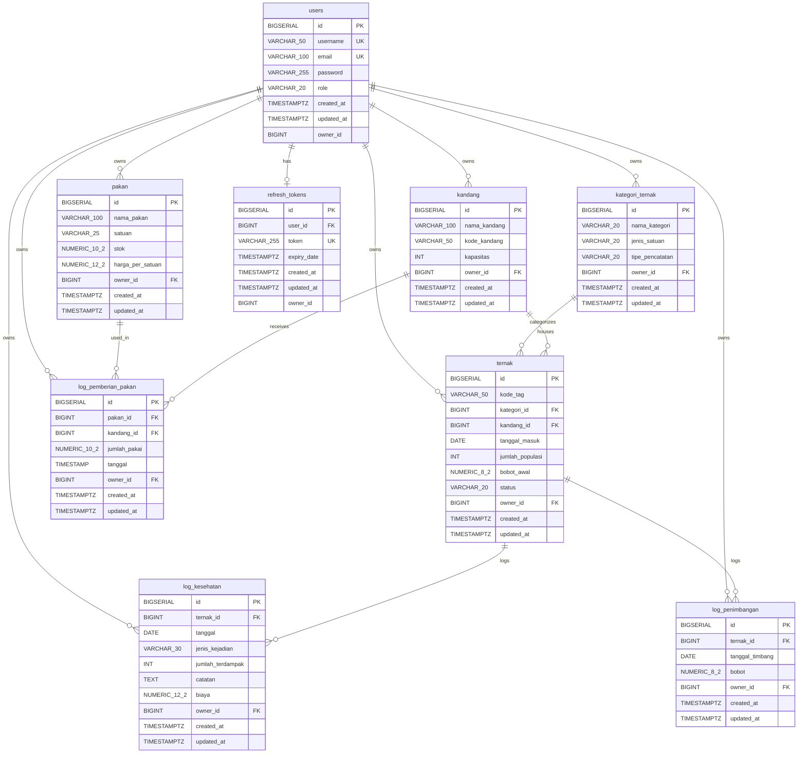

# manajemen-kandang-api

Backend RESTful API berbasis Java & Spring Boot untuk sistem manajemen inventaris peternakan, operasional harian, dan pencatatan kesehatan/pakan dengan dukungan arsitektur multi-tenant (data isolation) dan autentikasi JWT.

---

## Teknologi

* **Language**: Java 17
* **Framework**: Spring Boot 4.1.1 (WebMVC, Data JPA, Security, Validation)
* **Database**: PostgreSQL
* **Database Migration**: Flyway
* **Security**: Spring Security, JJWT (io.jsonwebtoken 0.12.5)
* **Documentation**: Springdoc OpenAPI / Swagger UI 3.1.0
* **Testing**: JUnit 5, Mockito, MockMvc, H2 Database

---

## Fitur Utama

1. **Authentication & Authorization**: Stateless JWT (Access Token 15 menit & Refresh Token Rotation 7 hari).
2. **Data Isolation (Tenant Isolation)**: Pemfilteran data otomatis berbasis `owner_id` untuk mencegah pengaksesan lintas user.
3. **Master Data Management**: Pengelolaan data kandang, kategori ternak, dan pakan.
4. **Operasional & Inventaris**: Pencatatan populasi ternak, pengurangan populasi, riwayat penimbangan (ADG), log kesehatan, dan penggunaan pakan.
5. **Database Migration**: Skema versi otomatis menggunakan Flyway.
6. **API Documentation**: Integrasi Swagger UI interaktif dengan dukungan *Bearer Auth*.

---

## Cara Instalasi & Menjalankan
Prasyarat
* Java 17 atau lebih baru
* Maven 3.8+
* PostgreSQL 14+

1. git clone [https://github.com/username/manajemen-kandang-api.git](https://github.com/username/manajemen-kandang-api.git)  
   cd manajemen-kandang-api
2. Buat database PostgreSQL sesuai pada konfigurasi application.properties
3. Sesuaikan src/main/resources/application.properties  
   spring.datasource.url=jdbc:postgresql://localhost:5432/`db_name`  
   spring.datasource.username=`postgres`  
   spring.datasource.password=`postgres`  
   app.jwt.secret=`change_32_random_chars`  
   app.jwt.expiration-ms=`900000`  
   app.jwt.refresh-expiration-ms=`604800000`
4. Jalankan Aplikasi
   `mvn spring-boot:run`
5. Akses swagger UI `http://localhost:8080/swagger-ui.html`

---

## Testing
Proyek ini dilengkapi dengan Unit Test (Mockito) dan Integration Test (MockMvc & H2 In-Memory Database).  
Jalankan seluruh test suite dengan perintah:  
`mvn test`

## Skema Database (ERD)

